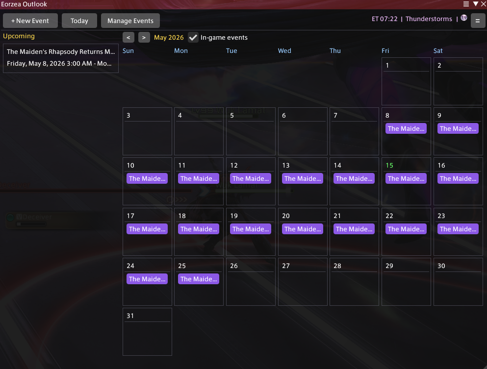

# EorzeaOutlook


EorzeaOutlook is a Dalamud plugin for personal calendar events, reminders, and official Lodestone in-game event tracking.

## Install

Add this URL under Dalamud Settings > Experimental > Custom Plugin Repositories:

```text
https://raw.githubusercontent.com/supasentaidalmud/eorzeaoutlook/master/repo.json
```

Use `/pcalendar` or `/pcal` to open Eorzea Outlook.



## Build From Source

Open `EorzeaOutlook.sln` and build the solution in `Debug` or `Release`. Build output is written under `EorzeaOutlook/bin/x64/`.
