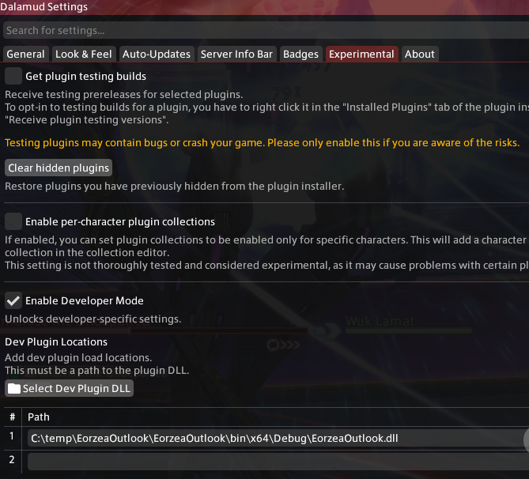

# EorzeaOutlook

EorzeaOutlook is a Dalamud plugin for personal calendar events, reminders, and official Lodestone in-game event tracking.


## Building

1. Open `EorzeaOutlook.sln`.
2. Build the solution in `Debug` or `Release`.
3. The plugin output is written to `EorzeaOutlook/bin/x64/Debug/`.

## Dalamud Dev Plugin Loading

1. Build the solution.
2. In Dalamud Settings, open the `Experimental` tab and enable `Enable Developer Mode`.
3. Under `Dev Plugin Locations`, select the plugin DLL:
   `C:\temp\EorzeaOutlook\EorzeaOutlook\bin\x64\Debug\EorzeaOutlook.dll`
4. Reload dev plugins.



Dalamud expects the generated `EorzeaOutlook.json` manifest to stay next to `EorzeaOutlook.dll` in the build output folder.

## Custom Plugin Repository

Add this URL under Dalamud Settings > Experimental > Custom Plugin Repositories:

```text
https://raw.githubusercontent.com/supasentaidalmud/eorzeaoutlook/master/repo.json
```

## In Game

Use `/pcalendar` or `/pcal` to open Eorzea Outlook.


